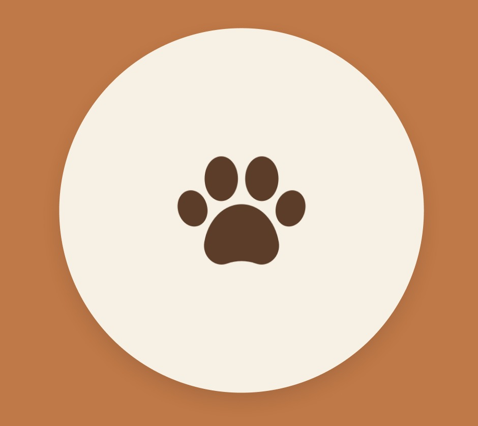

<div align="center">
  
  <h1>🐾 Petin</h1>
  <p><em>Saúde e carinho em cada patinha</em></p>
  <p>
    
    
    
    
    
    
  </p>
  <p>
    <b>Status do Projeto:</b> 🚧 Em Fase de Idealização (Checkpoint 4) 
  </p>
</div>

---

## 📝 Descrição do Projeto

**Petin** é um aplicativo mobile desenvolvido em **React Native** que tem como missão transformar a forma como os tutores cuidam da saúde dos seus pets. 

Atualmente, o gerenciamento de vacinas, consultas e rotina de medicamentos é feito de forma dispersa: carteirinhas de vacinação são perdidas, datas de reforço são esquecidas e o histórico veterinário fica restrito à memória do tutor. 

O **Petin** resolve isso centralizando tudo em um único lugar, com lembretes inteligentes e a possibilidade de compartilhar o prontuário do pet com o veterinário em tempo real. Nosso objetivo é garantir que nenhum pet fique sem sua dose de carinho e cuidado.

---

## 🖼️ Demonstração Visual

> *As telas abaixo representam a identidade visual do projeto, desenvolvidas no Figma. As funcionalidades estão em fase de implementação.*

🔗 **[Acessar Protótipo no Figma](https://www.figma.com/proto/nD5XSQOaVLNMA6bBoJ2MJA/Sem-t%C3%ADtulo?node-id=5-165&t=teiQvUETLAFzmC1V-1)**

<div align="center">
  
  <p><i>Em breve: GIF animado com a navegação completa do app.</i></p>
</div>

---

## ✨ Principais Funcionalidades

- ✅ **Dashboard Inteligente:** Visão geral do pet com próximos eventos (vacinas e consultas) em destaque.
- ✅ **Prontuário Digital:** Cadastro completo do pet (nome, raça, idade, peso e alergias).
- ✅ **Calendário de Vacinas:** Controle de doses aplicadas e agendamento das próximas.
- ✅ **Histórico de Consultas:** Registro de idas ao veterinário com anexo de exames e receitas.
- ✅ **Rotina de Medicamentos:** Horários para vermífugos, antipulgas e suplementos.
- ✅ **Alertas Proativos:** Notificações push para não perder nenhuma data importante.
- ✅ **Compartilhamento de Prontuário:** Geração de link/PDF seguro para enviar ao veterinário *(em desenvolvimento para a versão Premium)*.

---

## 🛠️ Tecnologias Utilizadas

| Ferramenta | Finalidade |
| :--- | :--- |
| **React Native (Expo)** | Framework principal para construção do app mobile (Android/iOS). |
| **React Navigation** | Gerenciamento de rotas e navegação entre telas (Stack e Tab). |
| **Axios** | Cliente HTTP para consumo da API (Mock ou Backend real). |
| **JSON Server** | Simulação de uma API REST para testes e prototipação (Mock). |
| **Context API / AsyncStorage** | Gerenciamento de estado local e persistência de dados. |
| **Figma** | Prototipação das interfaces e definição do Design System. |

---

## 🚀 Como Instalar e Rodar o Projeto

Siga os passos abaixo para configurar o ambiente de desenvolvimento local e visualizar o aplicativo em seu dispositivo ou emulador.

### 📋 Pré-requisitos

Antes de começar, verifique se você possui instalado em sua máquina:

- [Node.js](https://nodejs.org/) (versão 16 ou superior)
- [Git](https://git-scm.com/)
- [Expo CLI](https://docs.expo.dev/get-started/installation/) (instalado globalmente)
- Um smartphone com o aplicativo **Expo Go** (Android/iOS) ou um emulador configurado.

### 🔧 Instalação e Execução

1.  **Clone o repositório**
    ```bash
    git clone https://github.com/challengelotus/checkpoint4-mdi-petin
    ```

2.  **Acesse a pasta do projeto**
    ```bash
    cd checkpoint4-mdi-petin
    ```

3.  **Instale as dependências do projeto**
    ```bash
    npm install
    # ou
    yarn install
    ```

4.  **Inicie o servidor Mock (JSON Server) - Obrigatório para testes**
    > *Este servidor simula o backend e fornece os dados para o app.*
    ```bash
    npx json-server mock-api/db.json --port 3000
    ```

5.  **Execute o aplicativo com o Expo**
    ```bash
    npx expo start
    ```

6.  **Visualize o app**
    - Escaneie o QR Code gerado no terminal com o aplicativo **Expo Go** (Android) ou pela câmera do iPhone (iOS).
    - Ou pressione `a` para abrir no emulador Android / `i` para emulador iOS.

---

## 💡 Como Usar (Guia Básico)

Após rodar o projeto, você terá acesso à versão inicial do aplicativo:

1.  **Cadastro/Login:** Crie uma conta ou utilize o usuário mockado (ex: `admin@petin.com` / `123456`).
2.  **Adicionar Pet:** Clique no botão "+" na tela inicial para cadastrar as informações do seu animal.
3.  **Registrar Vacina:** Acesse o perfil do pet, vá até a aba "Saúde" e clique em "Adicionar Vacina". Preencha o nome, data de aplicação e próxima dose.
4.  **Receber Alertas:** Com a notificação habilitada, o app avisará automaticamente quando uma vacina estiver próxima do vencimento.

---

## 👥 Equipe de Desenvolvimento

Este projeto está sendo desenvolvido como parte do curso de Mobile Development & IoT. Conheça os responsáveis:

| Função | Integrante | RM |
| :--- | :--- | :--- |
| **Product Owner (PO) & Documentação** | João Victor Soave | RM557595 |
| **Designer & Branding (UI/UX)** | Maria Alice Freitas Araújo | RM557516 |
| **Desenvolvedor Front-End (Setup)** | Pedro Henrique Mendes dos Santos | RM555332 |
| **Desenvolvedor Back-End & Mock** | Rafael Teofilo Lucena | RM555600 |
| **Desenvolvedor Back-End & Negócio** | Vinícius Fernandes Tavares Bittencourt | RM558909 |

---

## 📄 Licença

Este projeto está licenciado sob os termos da **MIT License**. Consulte o arquivo [LICENSE](LICENSE) para mais detalhes.

---

<div align="center">
  <sub>Construído com ❤️ para o bem-estar dos nossos amigos de quatro patas.</sub>
</div>
