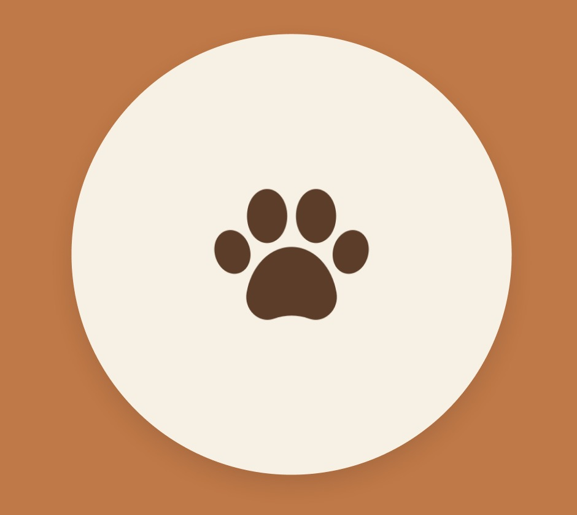

<div align="center">
  
  <h1>🐾 Petin</h1>
  <p><em>Saúde e carinho em cada patinha</em></p>
  <p>
    
    
    
    
    
    
  </p>
  <p>
    <b>Status do Projeto:</b> 🚧 Em desenvolvimento — fluxos principais implementados com Supabase; recursos de localização e lembretes ainda em evolução
  </p>
</div>

## 📌 O Problema

Você já passou por alguma dessas situações?

- ❌ Perdeu a carteirinha de vacinação do seu pet e não lembra quais doses já foram aplicadas?
- ❌ Esqueceu a data do próximo vermífugo ou da vacina antirrábica?
- ❌ Chegou no veterinário sem saber informar o histórico de alergias ou cirurgias do animal?
- ❌ Não tem um lugar único para guardar os comprovantes de consultas e exames?

**Essa é a realidade da maioria dos tutores de pets.** A falta de um prontuário digital centralizado coloca a saúde dos animais em risco e gera estresse desnecessário para os donos. O **Petin** nasceu para acabar com esse problema.

---

## 🚀 A Solução

O **Petin** é um aplicativo mobile (React Native + Expo) que funciona como o **prontuário digital** do seu pet. Em vez de um simples calendário de lembretes, ele reúne em um só lugar:

- **Centralização:** vacinas, consultas, medicamentos, documentos e dados do pet acessíveis a qualquer momento.
- **Calendário de cuidados:** visão mensal com as doses de vacinas, medicamentos e consultas agendadas.
- **Próxima ação em destaque:** o dashboard de cada pet mostra qual é o próximo cuidado pendente.
- **Contatos de emergência:** veterinários e clínicas salvos, a um toque de ligar.
- **Tranquilidade:** o status do pet (`Em Dia`, `Atenção`, `Atrasado`) deixa claro se há algo pendente.

---

## 💡 Modelo de Negócio

O Petin adota o modelo **Freemium com assinatura Premium**. Os limites do plano gratuito são aplicados nos *services* (ao tentar criar o registro) e, quando atingidos, o usuário é levado à tela de assinatura.

| Recurso | Gratuito (Free) | Premium |
| :--- | :---: | :---: |
| **Pets cadastrados** | 1 pet | ✅ Ilimitado |
| **Vacinas** | Até 5 por pet | ✅ Ilimitado |
| **Medicamentos** | Até 3 por pet | ✅ Ilimitado |
| **Consultas** | Até 3 por pet | ✅ Ilimitado |
| **Documentos / anexos** | ❌ Não | ✅ Sim |
| **Preço** | **R$ 0,00** | **R$ 19,90** (configurável via `.env`) |

O pagamento é feito por um **link de checkout externo** (ex.: Stripe Payment Link ou Mercado Pago), aberto a partir da tela *Assinatura*. A URL recebe `client_reference_id` e `prefilled_email` para que um webhook identifique qual conta ativar (campo `plano` da tabela `usuarios`).

### Diferencial competitivo

| Concorrente | Foco principal | Lacuna que o Petin preenche |
| :--- | :--- | :--- |
| **DogHero** | Serviços (hospedagem e passeio) | Não foca em prontuário médico/calendário vacinal. |
| **Petlove** | E-commerce (rações e produtos) | O histórico de saúde é secundário. |
| **Agendas de pet genéricas** | Lembretes simples | Não anexam comprovantes nem organizam o histórico por pet. |
| **Petin** | **Saúde integral + rotina** | Unifica prontuário, calendário e contatos de emergência em um só app. |

---

## 🖼️ Demonstração Visual

> *As telas abaixo representam a identidade visual do projeto, desenvolvida no Figma.*

🔗 **[Acessar Protótipo no Figma](https://www.figma.com/proto/nD5XSQOaVLNMA6bBoJ2MJA/Sem-t%C3%ADtulo?node-id=5-165&t=teiQvUETLAFzmC1V-1)**

<div align="center">
  <video src="https://github.com/user-attachments/assets/e8a733e8-f860-4460-83c7-c2cf19018182" alt="Demonstração das Telas do Petin" width="700"/>
</div>

---

## ✨ Funcionalidades

### Implementadas

- ✅ **Autenticação:** cadastro, login, logout, alteração de senha e desativação de conta (Supabase Auth, sessão persistida no aparelho).
- ✅ **Gestão de pets:** cadastro, edição e remoção; foto de perfil (upload no Supabase Storage); seletor para alternar entre pets.
- ✅ **Dashboard do pet:** nome, status (`Em Dia` / `Atenção` / `Atrasado`) e card de **próxima ação** (vacina, medicamento ou consulta mais próximos).
- ✅ **Perfil do pet:** abas *Dados*, *Histórico* (gráfico de evolução de peso) e *Documentos*.
- ✅ **Vacinas:** cadastro com controle de doses (`PENDENTE` / aplicada) e histórico vacinal.
- ✅ **Medicamentos:** cadastro com dosagem, frequência e doses programadas.
- ✅ **Consultas:** registro de consultas (local, data/hora, observação) e listagem das futuras no perfil do usuário.
- ✅ **Calendário:** visão mensal com marcação dos dias que têm eventos e lista dos eventos do dia selecionado.
- ✅ **Contatos de emergência:** cadastro de contatos e ligação direta pelo app.
- ✅ **Notas e documentos:** nova nota e anexos de documentos (Premium).
- ✅ **Planos Free/Premium:** limites aplicados nos services e tela de assinatura com checkout externo.
- ✅ **Preferências de lembretes:** o usuário escolhe lembretes de vacinas e consultas (salvo localmente).

### Em desenvolvimento / planejado

- 🚧 **Localizar veterinário** e **Localizar pet:** as telas existem, mas o mapa ainda é um *placeholder* (sem integração com mapa/GPS/rastreador).
- 🚧 **Notificações push:** as preferências de lembrete já existem, mas o agendamento/envio de notificações ainda não está implementado.
- 🚧 **Compartilhamento de prontuário (PDF):** a camada de dados (`prontuarioService`) já consolida pet, vacinas e medicamentos; falta a geração/compartilhamento do PDF.
- 🚧 **Atividades recentes** no dashboard do pet ainda usam dados de exemplo.
- 💭 **Lembretes por WhatsApp/e-mail**, backup em nuvem e relatórios mensais de saúde.

---

## 🛠️ Tecnologias Utilizadas

| Ferramenta | Finalidade |
| :--- | :--- |
| **React Native + Expo** | Framework do app mobile (Android/iOS). |
| **TypeScript** | Tipagem estática em todo o projeto. |
| **Expo Router** | Navegação baseada em arquivos (Stack + Tabs, grupos `(auth)` e `(tabs)`). |
| **Supabase** (`@supabase/supabase-js`) | Backend: autenticação, banco PostgreSQL e Storage. |
| **AsyncStorage** | Persistência da sessão e das preferências do usuário. |
| **Context API** | Estado global de autenticação (`AuthContext`). |
| **expo-image-picker** | Seleção de fotos (pets, perfil, documentos). |
| **Poppins** (`@expo-google-fonts/poppins`) | Tipografia do app. |
| **@expo/vector-icons** | Ícones. |
| **Figma** | Prototipação e Design System. |

---

## 🗂️ Estrutura do Projeto

```
app/                         # Rotas (Expo Router)
├── index.tsx                # Splash
├── (auth)/                  # login, cadastro
├── (tabs)/                  # home, calendario, localizar, perfil
├── dashboard-pet.tsx        # Dashboard de um pet
├── perfl-pet.tsx            # Perfil do pet (Dados / Histórico / Documentos)
├── cadastrar-pet.tsx · editar-pet.tsx
├── nova-vacina.tsx · medicamentos.tsx · novo-medicamento.tsx · nova-nota.tsx
├── emergencia.tsx · novo-contato.tsx
├── localizar-pet.tsx · localizar-veterinario.tsx
├── editar-perfil.tsx · alterar-senha.tsx · assinatura.tsx

src/
├── components/              # Componentes reutilizáveis (Button, Calendar, PetCard, ...)
├── contexts/AuthContext.tsx # Sessão e usuário logado
├── hooks/useAtivoPet.ts     # Resolve o pet ativo da tela (param `petId` ou primeiro pet)
├── services/supabase/       # Acesso ao Supabase (um service por entidade)
├── types/                   # Interfaces e DTOs de cada entidade
├── theme/                   # Cores, tipografia e espaçamento
└── utils/                   # Datas, planos/limites, imagens, preferências
```

O alias `@/` aponta para `src/` (ex.: `@/components/Button/Button`).

### Modelo de dados (Supabase)

Tabelas utilizadas pelo app: `usuarios`, `pets`, `historico_pets`, `vacinas`, `doses_vacinas`, `medicamentos`, `doses_medicamentos`, `consultas`, `contatos` e `documentos`. As imagens são enviadas ao bucket `petin-midias` do Storage.

---

## 🚀 Como Instalar e Rodar o Projeto

### 📋 Pré-requisitos

- [Node.js](https://nodejs.org/) (versão LTS recomendada)
- [Git](https://git-scm.com/)
- Um projeto no [Supabase](https://supabase.com/) com as tabelas listadas acima e o bucket `petin-midias`
- Um smartphone com o app **Expo Go** (Android/iOS) ou um emulador configurado

### 🔧 Instalação e execução

1. **Clone o repositório**
   ```bash
   git clone https://github.com/challengelotus/checkpoint4-mdi-petin
   cd checkpoint4-mdi-petin
   ```

2. **Instale as dependências**
   ```bash
   npm install
   ```

3. **Configure as variáveis de ambiente**

   Crie um arquivo `.env` na raiz do projeto:
   ```env
   EXPO_PUBLIC_SUPABASE_URL=https://<seu-projeto>.supabase.co
   EXPO_PUBLIC_SUPABASE_ANON_KEY=<sua-anon-key>
   ```
   > Sem as variáveis do Supabase o app abre, mas exibe um aviso no console e as requisições falham.

4. **Inicie o app**
   ```bash
   npx expo start
   ```

5. **Visualize o app**
   - Escaneie o QR Code com o **Expo Go** (Android) ou com a câmera (iOS).
   - Ou pressione `a` (emulador Android) / `i` (simulador iOS).

---

## 💡 Como Usar (Guia Básico)

1. **Cadastro/Login:** toque na tela inicial, crie uma conta e entre.
2. **Adicionar pet:** na aba *Início*, cadastre o seu animal (nome, espécie, raça, nascimento, peso, microchip e foto).
3. **Dashboard do pet:** abra o pet para ver o status, a próxima ação e os atalhos (nova vacina, medicamentos, perfil, localizar).
4. **Registrar vacina ou medicamento:** use os atalhos do dashboard e preencha os dados; as doses aparecem no calendário.
5. **Calendário:** na aba *Calendário*, navegue pelos meses e toque em um dia para ver os eventos.
6. **Emergência:** salve contatos de veterinários e ligue direto pelo app.
7. **Assinatura:** em *Perfil → Assinatura*, veja seu plano e assine o Premium para remover os limites.

---

## 👥 Equipe de Desenvolvimento

Este projeto está sendo desenvolvido como parte do curso de Mobile Development & IoT.

| Função | Integrante | RM |
| :--- | :--- | :--- |
| **Product Owner (PO) & Documentação** | João Victor Soave | RM557595 |
| **Designer & Branding (UI/UX)** | Maria Alice Freitas Araújo | RM557516 |
| **Desenvolvedor Front-End (Setup)** | Pedro Henrique Mendes dos Santos | RM555332 |
| **Desenvolvedor Back-End & Mock** | Rafael Teofilo Lucena | RM555600 |
| **Desenvolvedor Back-End & Negócio** | Vinícius Fernandes Tavares Bittencourt | RM558909 |

---

## 📄 Licença

Este projeto está licenciado sob os termos da **MIT License**. Consulte o arquivo [LICENSE](LICENSE) para mais detalhes.

---

<div align="center">
  <sub>Construído com ❤️ para o bem-estar dos nossos amigos de quatro patas.</sub>
</div>
